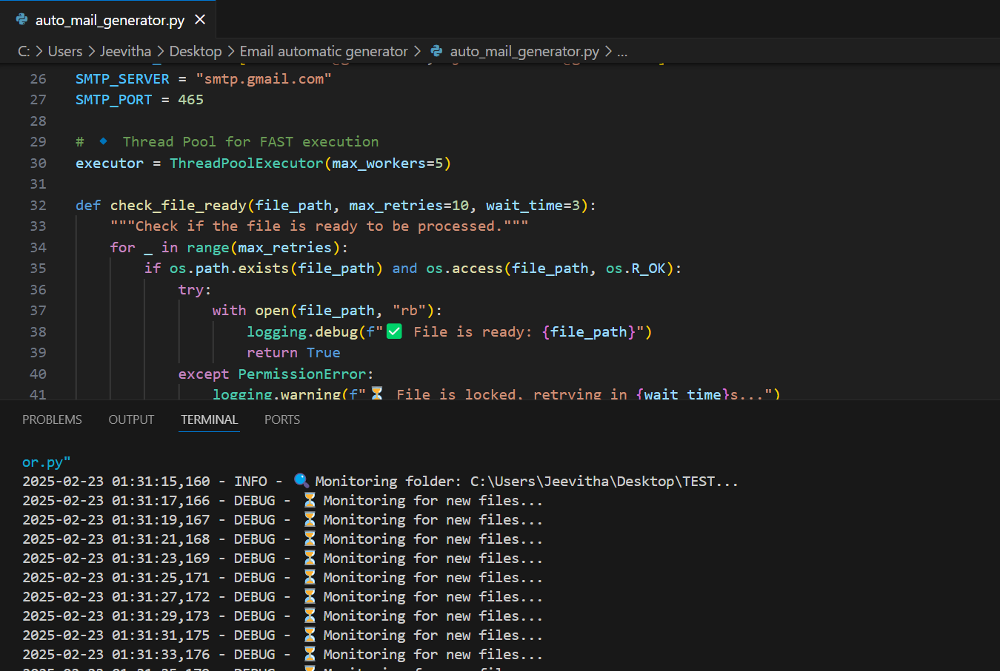
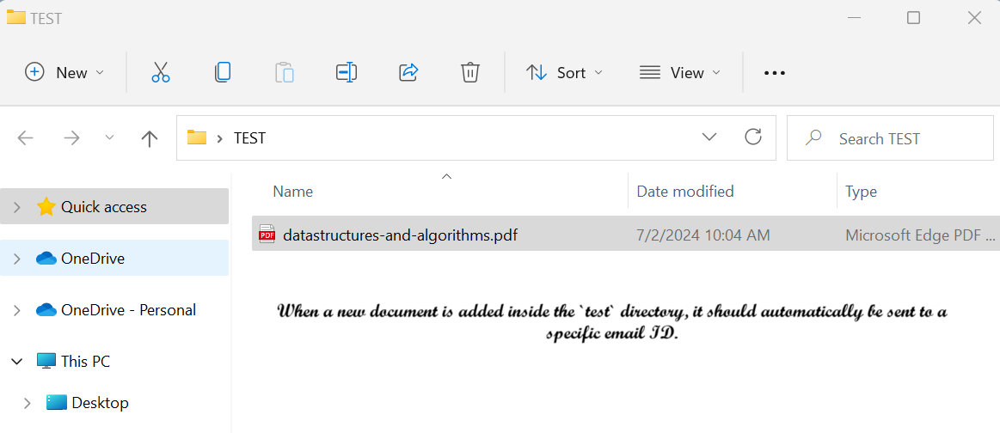
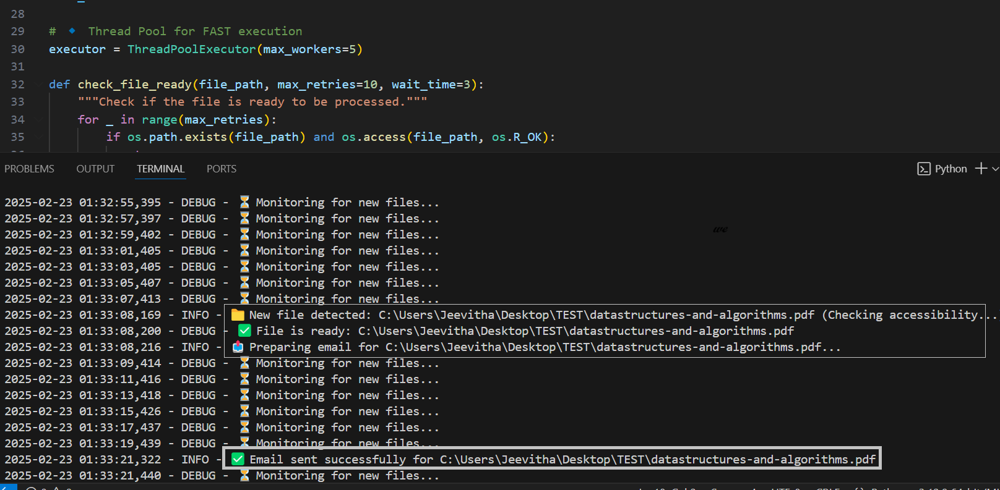
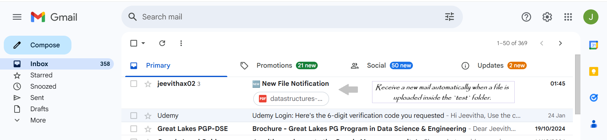

# Automated File Monitoring & Email Notification

## Overview
This Python script continuously monitors a specified folder for newly created files. When a new file is detected, it verifies accessibility and automatically sends it as an email attachment to specified recipients. The script ensures efficient execution using multithreading and logs all events for better debugging and traceability.

## Problem Statement
Manually tracking file additions and sharing them via email is time-consuming and prone to errors. This project aims to automate the process, ensuring timely notifications and email distribution whenever a new file is added to the folder.

## Solution
This script automates:
- Monitoring a designated folder for new files.
- Ensuring file readiness before processing.
- Sending an email with the file as an attachment to predefined recipients.
- Logging events and errors for debugging.

## Features
- Real-time folder monitoring using `watchdog`.
- Multithreaded execution for faster performance.
- Automated email notifications with attachments.
- Robust file accessibility checks to prevent errors.

## How It Works
1. The script starts monitoring the specified folder.
2. When a new file is created, it verifies accessibility.
3. Once the file is ready, the script composes an email with the file as an attachment.
4. The email is sent to the predefined recipients using `smtplib`.
5. Logs are recorded for debugging and tracking execution.

## Tools & Technologies Used
- Python - Core programming language
- `watchdog` - Real-time file monitoring
- `smtplib` - Email sending functionality
- MIME - Email attachments handling
- ThreadPoolExecutor - Multi-threading for better performance
- Logging - Event tracking and debugging

## Screenshots





## Setup & Usage
### Prerequisites
- Python installed on your system
- SMTP configuration with an app password (for Gmail, enable 2-Step Verification and create an App Password)
- Required Python libraries installed (`watchdog`, `psutil`)

### Installation
1. Clone the repository or download the script.
2. Install dependencies using:
   ```sh
   pip install watchdog psutil
   ```
3. Update the configuration variables in the script:
   ```python
   FOLDER_TO_WATCH = "C:\\Users\\Jeevitha\\Desktop\\TEST"
   SENDER_EMAIL = "your-email@gmail.com"
   SENDER_PASSWORD = "your-app-password"
   RECIPIENT_EMAILS = ["recipient1@gmail.com", "recipient2@gmail.com"]
   ```
4. Run the script:
   ```sh
   python file_monitor.py
   ```

## Future Enhancements
- Support for multiple folder monitoring.
- Web interface for managing configurations.
- Database logging for tracking sent files.

